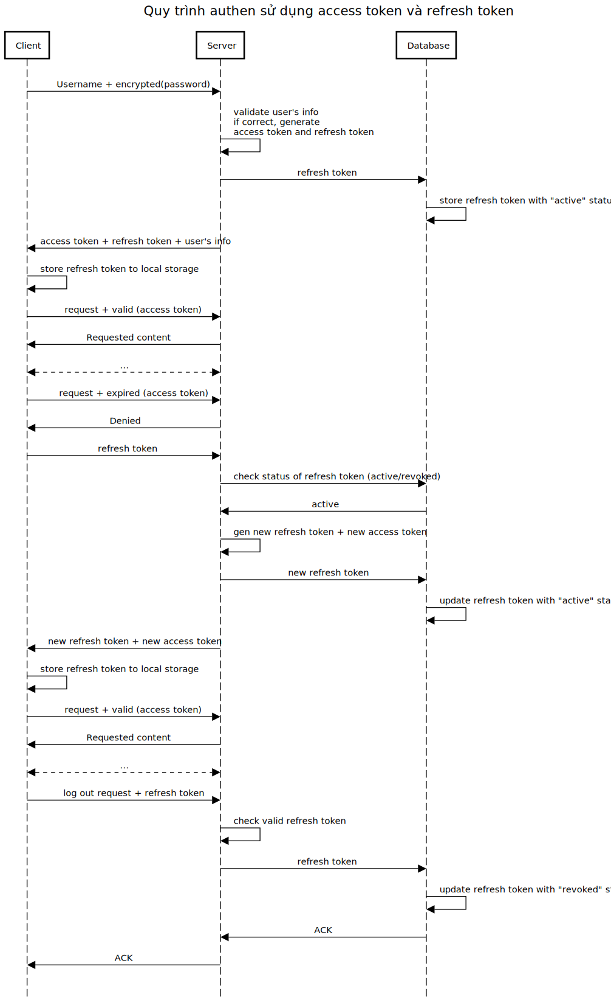
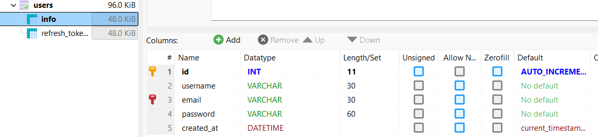
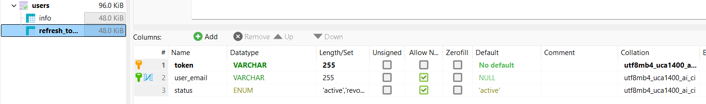

# Minh hoạ workflow authenciation khi sử dụng jwt

## Giới thiệu

Đây là 1 phiên bản cài đặt của việc áp dụng jwt cho nodejs

## Table of Contents

1. [Tổng quan](# "Tổng quan")

2. [JWT](#JWT)
3. [Database](#Database)

## Tổng quan

## JWT
[Đọc thêm về JWT](https://duthanhduoc.com/blog/p3-giai-ngo-authentication-jwt)

## Database

  
   
  <em>Bảng 1: Thông tin người dùng</em>

  
   
  <em>Bảng 2: Refresh Token</em>

